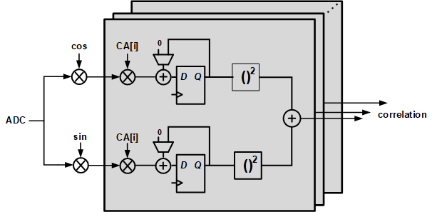
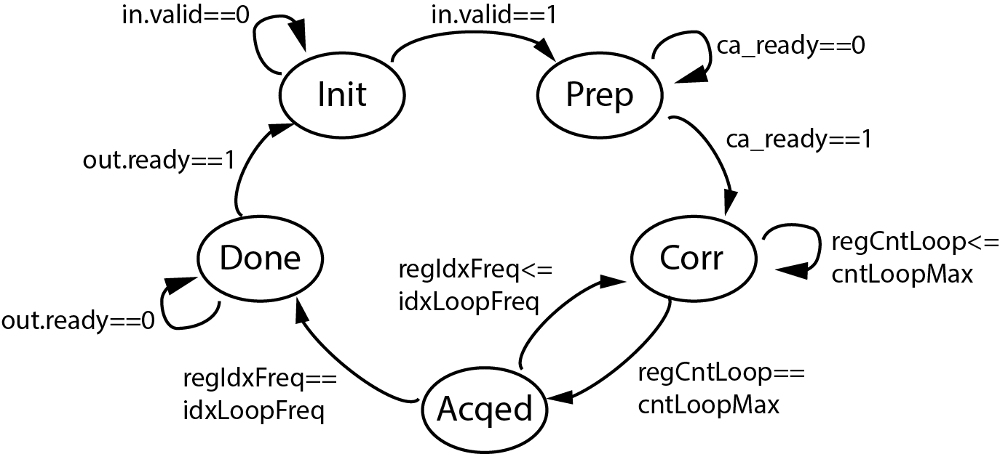

## GPS Parallel Acquisition Loop Generator

The parallel acquisition loop generator is a block using parallel search (in terms of code phase) to find out the coarse frequency and code phase of the signal with maximum correlation.

The acquisition channel uses one CA code block, several NCOs, a large shift register and plenty of correlators.
The clock of the acquisition loop is synchronized with the ADC clock. After being requested by the tracking loop, 



The acquisition loop will first take 16k clock cycles to prepare all the CA codes, then the shift register will turn into the loop shift register.
Then the NCO for ADC will get the control signal which represents the minimum frequency being swept, generate cosine and sine waves to mix with the ADC signals, and the correlators will take different phases of CA code to calculate the correlations with the ADC signal. 
After getting the correlations of one frequency, the signal representing the next frequency apply to the NCO and at the same time, the register recording the maximum correlation and freqeuncy / code phase with max correlation might update depending on whether there is larger correlation in the correlation array.
Finishing all the frequencies of interest, the maximum correlation, the sum of the correlation, and the optimal frequency & code phase are 
all obtained, depending on the ratio of the correlation sum to the maximum correlation, the acquisition loop can tell if the satellite requested by 
the tracking loop is found, and give the optimal freqeuncy and code phase to the tracking channel. 
The state machine of parallel aquisition is shown as follows.

<<<<<<< HEAD

=======

>>>>>>> a64bb90c2b925c1a39b8ceeb7b38ec6455358c85

### Parameters

#### CAParams Class

To allow some degree of parametrization, the acquisition loop block has a specific class of params that can be passed in. 

```
EgALoopParParams(
	val wADC: Int,
    val wCA: Int,
    val wNCOTct: Int,
    val wNCORes: Int,
    val nSample: Int,
    val nLoop: Int,
    val nFreq: Int,
    val nCPSample: Int,
    val CPMin: Int,
    val CPStep: Int,
    val freqMin: Int,
    val freqStep: Int,
    val fsample: Int,
    val fchip: Int
)
```
Here wXXX represents the width of signal from a block; nSample is the number of samples from the ADC (also the number of code phases);
nLoop is the number of loops to get some correlation from signal with weak signal power and strong noise power; nFreq is the number of frequency points
we would like to sweep; nCPSample, CPMin and CPStep is the number of code phases we would like to sample (e.g. we have 16368 code phases but we don't really
need to get the correlation of all, we can just get 2046 correlation of code phase 0, 8, 16, ... and let the tracking loop find the resolute 
code phase so that the area of the correlator can be substantially reduced. Sometimes during testing we also would like to reduce the number of 
correlators to reduce compilation time, e.g. if we already know that the optimal code phase is around 1000, we can just let CPMin = 950, CPStep = 2 
and nCPSample = 51 to get the correlation of code phase 950, 952, ..., 1050). freqMin and freqStep represent the minimum freqeuncy and the step
of freqeuncy during sweeping; fsample is the sampling rate of the ADC and fchip is the frequency of CA chips, these two helps to set the correct
input code for the NCO.


#### Inputs:

-  `ADC`: SInt, ADC output data
-  `idx_sate`: UInt, index of satellite from the tracking channel, should be 1-32
-  `debugCA`: Bool, debug signal, can use external CA code instead of the signal from the CA block if true
-  `debugNCO`: Bool, debug signal, can use external cosine and sine wave signals instead of the signal from the NCO block if true
-  `CA`: SInt, external CA code
-  `cos`: SInt, external cosine signal
-  `sin`: SInt, external sine signal


#### Outputs:

-  `iFreqOpt`: UInt, the index of the optimal freqeuncy
-  `freqOpt`: UInt, the real value of the optimal frequency
-  `CPOpt`: UInt, the value of the optimal code phase
-  `max`: SInt, the maximum correlation obtained
-  `sum`: SInt, the sum of all the correlations
-  `sateFound`: Bool, tell if a satellite is found, true if max/sum is large enoough


#### Tests:

- ALoopPar tester
  - Load a binary file with real GPS data, see if we can find the optimal frequency and code phase, no "expect" in the tester but will peek the output
    in the end.


#### Results
<<<<<<< HEAD
With input data from http://gfix.dk/matlab-gnss-sdr-book/gnss-signal-records/ (giovAandB_short.zip), after searching 40 frequcencies with 500Hz frequency step and 2046 code with 8 code phase step. The parallel search could find the optimal frequency and code phase as following figure as expected.


=======
- With input data from http://gfix.dk/matlab-gnss-sdr-book/gnss-signal-records/ (giovAandB_short.zip), after searching 40 different frequcencies with 500Hz step size and 2046 code with 8 code phase step. The parrallel search could find the optimal frequency and code phase as following figure as expected.


>>>>>>> a64bb90c2b925c1a39b8ceeb7b38ec6455358c85
