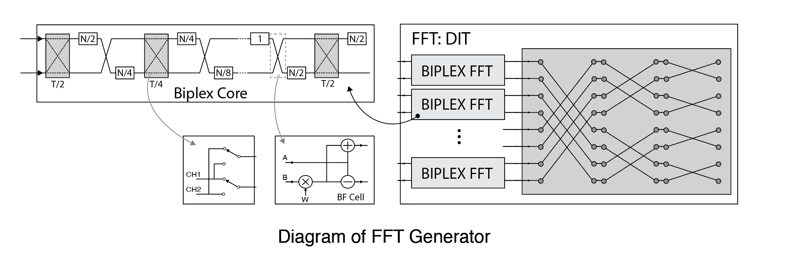
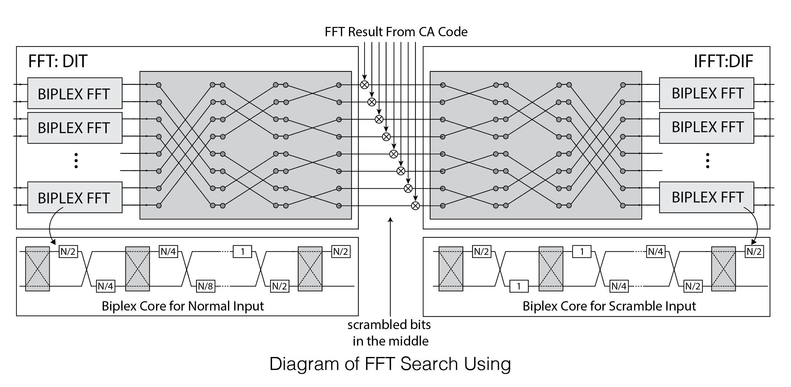
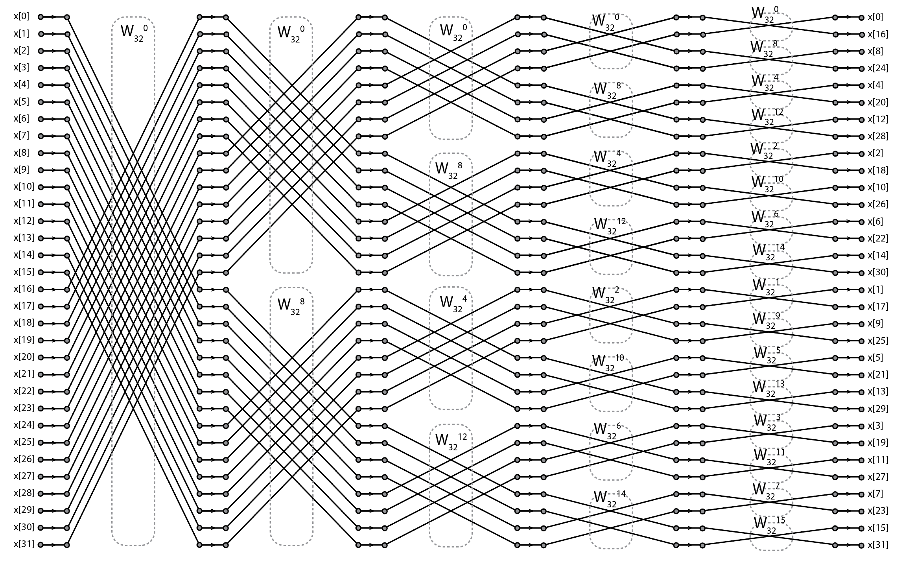
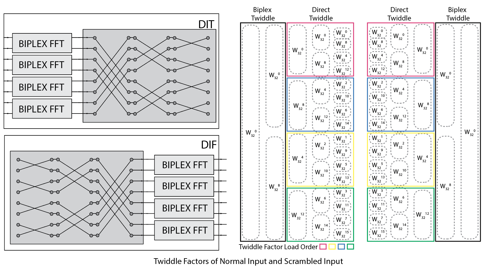

# FFT Generator
## Architecture
The FFT generator supports number of points is any power of two and size of 4 or greater (n >= 4).
The input lanes(p=lanes) is equal or smaller than the number of points,
the input rate is divided down when input lanes is smaller than number of points.
It use cooley-tukey algorithm when p<n. First it takes p input each time, these point go through a (bp: biplex point = n/p) Biplex FFT and do a direct FFT for p points.
The input lanes must be a power of 2, greater than or equal to 2, but less than or equal to the FFT size.


### Pipelined FFT and Biplex FFT
Radix-2 Multipath Delay Commutator is a the most straightforward approach of pipelined FFT. 
When a new frame arrives, first half of points are multiplexed, delayed by N/2 samples and connected to the upper input of butterfly cell (BF).
The second half of points are selected and directly connected to the lower input of butterfly, and it will arrive BF simultaneously with the first half data. 
The output of first stage triggers the second stage.
The upper input of second stage connect to the first stage's output through a commutator, it switches between two inputs at different frequency.The swicth in each stage working at twice the frequency of the previous stage and delay cells have half of delay than the previous stage.
Therefore, the total required memory is N/2+N/4+N/4+...+2=3/2N-2. And the required BF cells number is log2(bp)
But in this case, the butterflies only works half the time.
By using biplex structure, each biplex core takes two channels' input and each butterfly works in an interleaved way for adjacent input samples and it can work at full rate. This result in the reduction of Biplex cells and memory usage.

### Cooley-Tukey
When the number of parallel inputs equals the FFT size, a simple, direct form, streaming FFT is used.
This FFT generator use cooley-tukey algorithm when the input lanes is smaller than number of points.
It is expected that the bits inputs contain time-series data time-multiplexed on the inputs,
such that on the first cycle are values x[0], x[1], …, x[p-1], then the next cycle contains x[p], x[p+1], … and this continues until the input is x[n-p], x[n-p+1], …, x[n-1].

### Output unscramble
With correct order input, the output of FFT will in bit-reversed order. If a direct form FFT is performed, the output order correction is simply rewiring. So when the generator is configured to be direct form (i.e. n=lanes). There is a unscrambleOut option to directly correct the bit order at the output.

However, when a two stages FFT is perform, there are some bit unscrambling happen between Biplex and Direct form FFT, and the  output bit order is not very straightforward. It can be correct by the following code:

```scala
\\ n: total fft points
\\ p: number of lanes
\\ bp: biplex fft points
def unscramble(in: Seq[Complex], p: Int): Seq[Complex] = {
  val n = in.size
  val bp = n/p
  val res = Array.fill(n)(Complex(0.0,0.0))
  in.grouped(p).zipWithIndex.foreach { case (set, sindex) =>
    set.zipWithIndex.foreach { case (bin, bindex) =>
      if (bp > 1) {
        val p1 = if (sindex/(bp/2) >= 1) 1 else 0
        val new_index = bit_reverse((sindex % (bp/2)) * 2 + p1, log2Up(bp)) + bit_reverse(bindex, log2Up(n))
        res(new_index) = bin
      } else {
        val new_index = bit_reverse(bindex, log2Up(n))
        res(new_index) = bin
      }
    }
  }
  res
}
```
In this case, the output cannot directly be used for applications which care about the correct order like GPS. 

### Inverse FFT For GPS
In GPS application, there are two FFTs needed for C/A code and DATA. And an IFFT is needed for finding the peak point where the maximum correlation happens.
The figure below shows the FFT search diagram. Two FFT blocks take DATA and C/A Code and perform FFT on these two signal. The result is multiplied in frequency domain. Then the mulitplication result is proccessed by the IFFT block.
Basically the generators work in a way that the correct order inputs (from DATA and CA code) are processed by the FFT generator in FFT and normal input configuration. After that, the output order is not very straightforward because of the two stage topology.
For large input points, pipelined topology is necessary to reduce the hardware cost, and the extra delay and memory for storing and reordering the bit order is non-ideal.
In order to support IFFT in acquisition process of GPS, the FFT generator need handle the output properly, unless it have to store the pipelined output than unsramble it.
So the IFFT configuration should be able to directly take the scrambled output from FFT and perform the IFFT to get the correct result with right order.
In this way, entire searching proccess can work continuously from the input of DATA to the output result.



#### Architecture for scrambled input
The figure below shows 32 points DIF FFT operation. The twiddle factors are annotated in dashed boxes.
The output bits are in bit-reverse order. With a symmetric DIF implementation the bit-reversed input can be bit-reversed again to convert back the correct order. 
The original FFT is two staged and the output bits are not in a pure bit-reversed order. But with proper "symmetrical" operation, the bit order can still be corrected in this way.



The symmetrical configuration is in the figure below. The IFFT use DIF butterfly.
The configuration with normal order input use biplex from as the first stage and followed by direct form. And the twiddle factors for each times the direct form is in operation is shown in the colored box. The order of loading twiddle factors is simiar to bit-reverse in group.
The configuration with scrambled input performs direct FFT first and output connect to Biplex FFT. The twiddle factor is mirrored. And the biplex FFT topology is also "mirrored" inside. 



## Parameters
```scala
  genIn: DspComplex[T],
  genOut: DspComplex[T],
  n: Int = 16, 
  pipelineDepth: Int = 0,
  lanes: Int = 8,
  quadrature: Boolean = true,
  inverse: Boolean = false,
  unscrambleOut: Boolean = false,
  unscrambleIn: Boolean = false
 ```
 - genIn and genOut: data type for the input and output of FFT
 - n: number of FFT points
 - lanes: number of input, if lanes<n, each FFT takes several cycle to get the full points it need.
 - pipelineDepth: number of extra pipeline stage inserted to generator
 - inverse: inverse FFT
 - unscrambleOut: with n=lanes, it should be easy for direct form to just re-wire the output to get the right order.
 - unscrambleIn: FFT/IFFT in DIF with scrambled input.
 
## IO
The FFT uses the DSP streaming interface (a subset of AXI4-Stream) on both the data input and data output. There are nominally no status or control registers, so no SCR file exists.
- Bits: the bits inputs contain time-series data time-multiplexed on the inputs, such that on the first cycle are values x[0], x[1], …, x[p-1], then the next cycle contains x[p], x[p+1], … and this continues until the input is x[n-p], x[n-p+1], …, x[n-1]. 
- Valid: The FFT delays the input valid by a value equal to the total data delay (biplex FFT delay + pipeline depth). When valid is low, the FFT creates zeros at its input. Internal counters continue to count, flushing out extant data. The shift register delaying the valid signal is set to all 0s during reset.
- Sync: The shift register delaying the sync signal is set to all 0s during reset. The first input sync signal will flush through, synchronizing all the FFT butterflies with the first dataset. The input sync is expected to be periodic in the size of the FFT (n) divided by the number of input lanes (p). Sync should be high on the last cycle of the spectrum. The new spectrum starts on the next valid cycle. When n=p, sync should always be high when valid is high.

## Tests  
The tester for FFT is in `FFTSpec.scala`. The `apply` in spectrumTester perform the tests for FFT generator. Basically there are three kinds of tester for debug purpose.
- The `getTone` function generates single tone input, the ideal result should be only one bin in the output spectrum
- The `getOne` function generates only one non-zero value in the input signal.
- Random test generate random number input.

In class `FFTSpec`, there is a Seq of test configurations setting, which pass in configurations to spectrum Tester.
