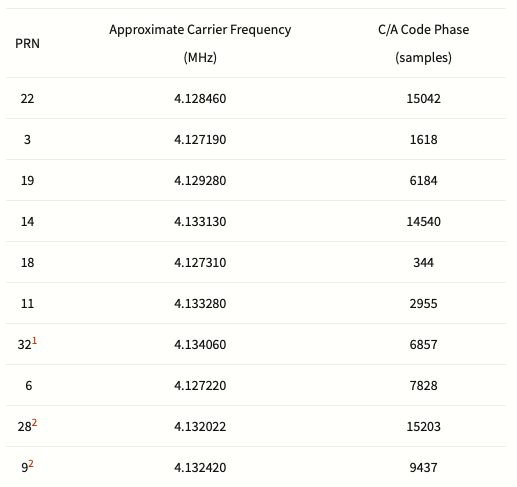
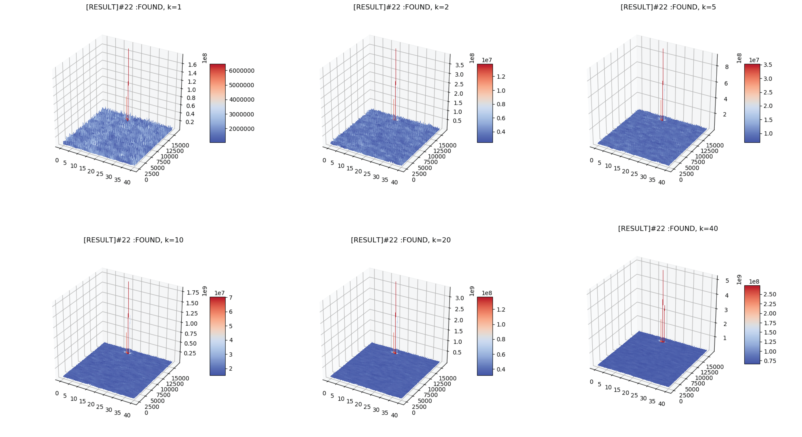

# Python Acquisition Model Use FFT Search
## Searching result

## Effect of different K

## Sparse FFT
For different k, the effect of Sparse FFT is tested in Python model(only Actually FFT time is accumulated, since SFFT need some extra pre-proccess of the data and it can only be done in a serial way in python).The table below shows the time for different k.
| k  | FFT time(ms) | Sparse FFT time(ms) |
|----|--------------|---------------------|
| 2  | 0.296140     | 0.094731            |
| 5  | 0.733505     | 0.273270            |
| 10 | 1.378309     | 0.492115            |
| 20 | 2.980500     | 1.014424            |

