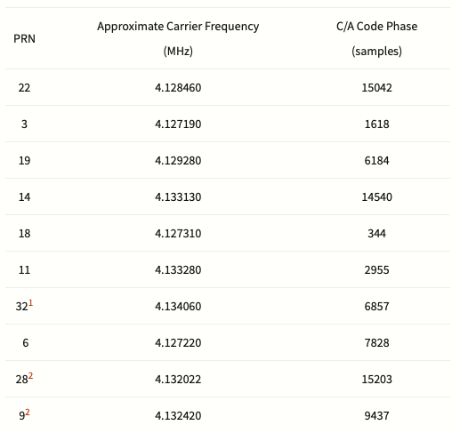
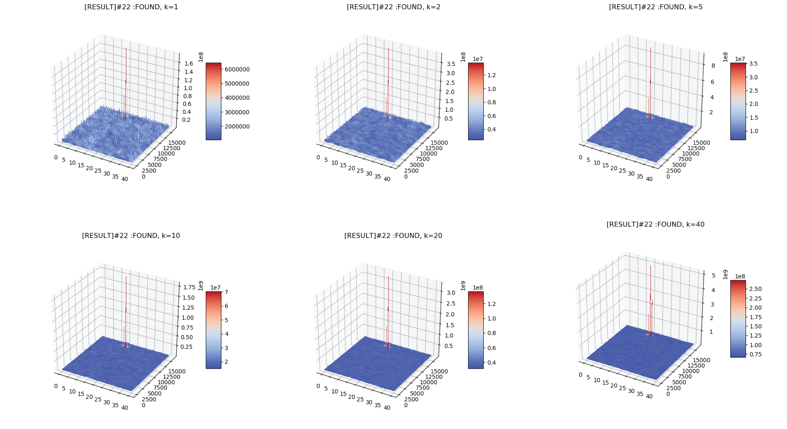
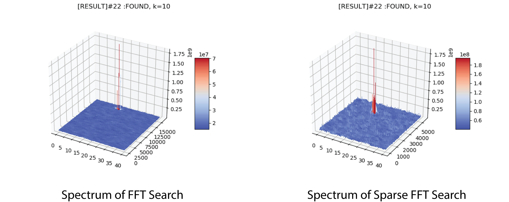

# Python Acquisition Model Use FFT Search
The dataset used for FFT searching test is this
[Samples of GNSS Signal Records](http://gfix.dk/matlab-gnss-sdr-book/gnss-signal-records/)
## Searching result
Use the dataset and simple acquisition model to test FFT search, can get the following results:
- [RESULT]#3 :FOUND LOC: freq:4127400, phase:1615
- [RESULT]#11 :FOUND LOC: freq:4133400, phase:2952
- [RESULT]#14 :FOUNDLOC: freq:4132900, phase:14537
- [RESULT]#18 :FOUND LOC: freq:4127400, phase:342
- [RESULT]#19 :FOUND LOC: freq:4129400, phase:6183
- [RESULT]#22 :FOUND LOC: freq:4128400, phase:15040

The table below is the SV infomation provided by the data source. From here we can see the phase is a little bit shift, which need tracking loop to locked the exact phase. Also, the frequency shift because of the finite doppler shift search resolution and range, and will also be covered by tracking loop.


## Effect of different K
- Larger K will improve the signal to noise ratio of weak satellite signal and will reduce the possibility of false acquisition. 
- The result of using different K when FFT searching is list in the figure below. For K=1, there is still obvious noise floor in plot 1, but it is gradually averaged out when K increase. In this case, even K=1 can get good SNR(sufficient to get correct phase). But the number of iterations should be parameterize in higher-level control logic generator.



## Sparse FFT
- The sparse FFT aliases the input data, which is equivalent to subsample FFT spectrum. Since for GPS application, the FFT result only have one peak ideally, the correct code phase can be obtained using the subsampled FFT result.
- For different k, the effect of Sparse FFT is tested in Python model(only Actually FFT time is accumulated, since SFFT need some extra pre-proccess of the data and it can only be done in a serial way in python).The table below shows the time for different k.

| k  | FFT time(s) | Sparse FFT time(s) |
|----|--------------|---------------------|
| 2  | 0.296140     | 0.094731            |
| 5  | 0.733505     | 0.273270            |
| 10 | 1.378309     | 0.492115            |
| 20 | 2.980500     | 1.014424            |



# Chisel Generator
The fft generator use existing code from
[fft-genearator](https://github.com/ucb-art/fft)
with some modifications in order to support IFFT and hook up to rocket chip.

## Modifications
### IFFT 
- Add inverse FFT configuration option.
- The original generator's twiddle factors are hard-coded and doesn't support inverse FFT. The twiddle factors in FFTConfig.scala is modified to support IFFT options.
- The result is not divided by N(# of points) since in GPS only the relative value is important, may modify this later.
### Tester
- Add tester that support IFFT. The ideal result is times N to compatible with generator.
- Only direct form of FFT/IFFT can pass test.

## Rocket-chip hook up
- Based on the lab2 template, hook up FFT/IFFT to rocket-chip. Add four readQueues/WriteQueues connect to FFT blocks and hook up to rocket chip to order to test FFT with C program.(From James)

Read Queue
```scala
    // instantiate a queue
    val queue0 = Module(new Queue(DspComplex(FixedPoint(18.W, 6.BP), FixedPoint(18.W, 6.BP)), depth))
    val queue1 = Module(new Queue(DspComplex(FixedPoint(18.W, 6.BP), FixedPoint(18.W, 6.BP)), depth))
    val queue2 = Module(new Queue(DspComplex(FixedPoint(18.W, 6.BP), FixedPoint(18.W, 6.BP)), depth))
    val queue3 = Module(new Queue(DspComplex(FixedPoint(18.W, 6.BP), FixedPoint(18.W, 6.BP)), depth))
    // connect streaming output to queue output
    queue0.io.enq.valid := (in.valid && !(queue1.io.enq.ready || queue2.io.enq.ready || queue3.io.enq.ready))
    queue0.io.enq.bits := in_bits(0)
    queue1.io.enq.valid := (in.valid && !(queue0.io.enq.ready || queue2.io.enq.ready || queue3.io.enq.ready))
    queue1.io.enq.bits := in_bits(1)
    queue2.io.enq.valid := (in.valid && !(queue0.io.enq.ready || queue1.io.enq.ready || queue3.io.enq.ready))
    queue2.io.enq.bits := in_bits(2)
    queue3.io.enq.valid := (in.valid && !(queue0.io.enq.ready || queue1.io.enq.ready || queue2.io.enq.ready))
    queue3.io.enq.bits := in_bits(3)
```
Write Queue
```scala
    // Instantiate queues
    val queue0 = Module(new Queue(DspComplex(FixedPoint(12.W, 7.BP), FixedPoint(12.W, 7.BP)), depth))
    val queue1 = Module(new Queue(DspComplex(FixedPoint(12.W, 7.BP), FixedPoint(12.W, 7.BP)), depth))
    val queue2 = Module(new Queue(DspComplex(FixedPoint(12.W, 7.BP), FixedPoint(12.W, 7.BP)), depth))
    val queue3 = Module(new Queue(DspComplex(FixedPoint(12.W, 7.BP), FixedPoint(12.W, 7.BP)), depth))
    // Connect queue output to streaming output
    out.valid := (queue0.io.deq.valid && queue1.io.deq.valid && queue2.io.deq.valid && queue3.io.deq.valid)
    // Create a vec for the dequeue output bits, which will later be collapsed
    val out_deq_bits = Wire(Vec(4, DspComplex(FixedPoint(12.W, 7.BP), FixedPoint(12.W, 7.BP))))
    out_deq_bits(0) := queue0.io.deq.bits
    out_deq_bits(1) := queue1.io.deq.bits
    out_deq_bits(2) := queue0.io.deq.bits
    out_deq_bits(3) := queue1.io.deq.bits
    // Collapse the dequeue bits for the streamNode
    out.bits.data := out_deq_bits.asUInt()
    // don't use last
    out.bits.last := false.B
    // Queue ready to deq when out is ready and the other queue is not valid (i.e., transaction not occurring on other queue).
    queue0.io.deq.ready := (out.ready && !(queue1.io.deq.valid || queue2.io.deq.valid || queue3.io.deq.valid))
    queue1.io.deq.ready := (out.ready && !(queue0.io.deq.valid || queue2.io.deq.valid || queue3.io.deq.valid))
    queue2.io.deq.ready := (out.ready && !(queue0.io.deq.valid || queue1.io.deq.valid || queue3.io.deq.valid))
    queue3.io.deq.ready := (out.ready && !(queue0.io.deq.valid || queue1.io.deq.valid || queue2.io.deq.valid))
```
- The FFT blocks also have memory connection and need to connect to pbus.

## TODOs:
- Look into the generators to pass tests for pipeline biplex version.
- Write C-program tester for FFT/IFFT. 
- Maybe use a ROM to pass in test for FFT to support large number of points tests or use more queues to test
- Implement Sparse FFT generator or add configuration option to FFT/IFFT generator


