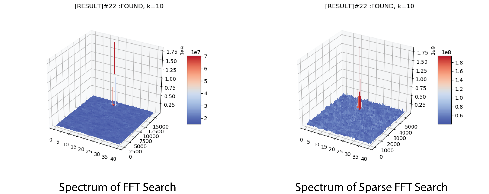

# Python Acquisition Model Use FFT Search
The dataset used for FFT searching test is this
[Samples of GNSS Signal Records](http://gfix.dk/matlab-gnss-sdr-book/gnss-signal-records/)
## Searching result
- [RESULT]#3 :FOUND LOC: freq:4127400, phase:1615
- [RESULT]#11 :FOUND LOC: freq:4133400, phase:2952
- [RESULT]#14 :FOUNDLOC: freq:4132900, phase:14537
- [RESULT]#18 :FOUND LOC: freq:4127400, phase:342
- [RESULT]#19 :FOUND LOC: freq:4129400, phase:6183
- [RESULT]#22 :FOUND LOC: freq:4128400, phase:15040

The table below is the SV infomation provided by the data source.

## Effect of different K
Larger K will improve the signal to noise ratio of weak satellite signal and will reduce the possibility of false acquisition. 
The result of using different K when FFT searching is list in the figure below.

## Sparse FFT
For different k, the effect of Sparse FFT is tested in Python model(only Actually FFT time is accumulated, since SFFT need some extra pre-proccess of the data and it can only be done in a serial way in python).The table below shows the time for different k.

| k  | FFT time(ms) | Sparse FFT time(ms) |
|----|--------------|---------------------|
| 2  | 0.296140     | 0.094731            |
| 5  | 0.733505     | 0.273270            |
| 10 | 1.378309     | 0.492115            |
| 20 | 2.980500     | 1.014424            |

# Chisel Generator

