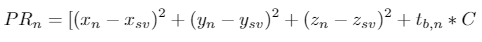
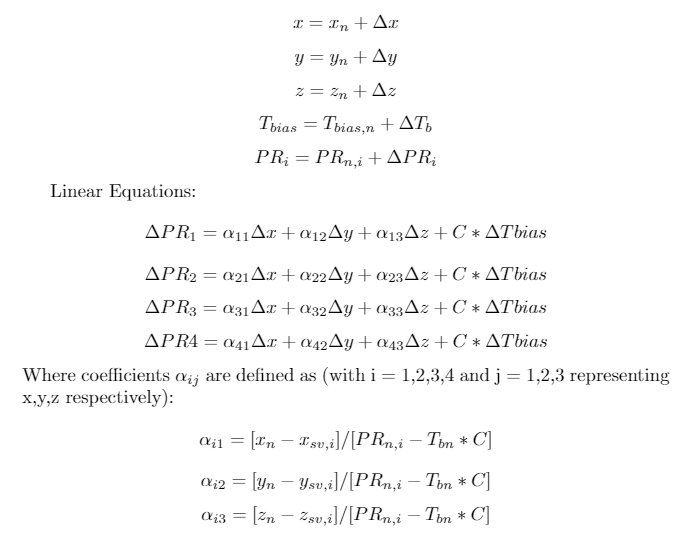
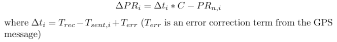
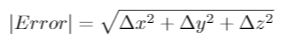

# Ranging Code

The ranging code is reponsible for taking the hardware decoded satellite parameters and converting them into user location values. The process is split into 3 main steps:

1. Extract hardware parameters, scale and convert
2. Compute satellite positions
3. Compute user position

The various computation functions are spread amongst various files, but the overarching algorithm is contained within `main.c`.

## Extract hardware parameters
The hardware parameters will be described later, but they are effectively the data encoded in satellite transmissions necessary to compute the satellite locations.
The parameter extraction is done via a direct read from memory mapped registers. The mapping was decided on prior to software implementation, and is summarized in `regmap.h`

Relevant files:
* `params.h`
* `regmap.h`
* `ranging.c` - `extract_params(int sat_offset, struct rcv_params *params)`
  * Inputs:
      * `sat_offset`: Integer
      * `*params`: Struct rcv_params pointer
  * Outputs:
    * None

The satellite parameters are stored in continuous memory addresses and a starting address. 
Every field in the satellite paramters is of a known width, which is also included in `regmap.h`.
Interfacing is done by knowing the starting memory address for the satellite parameters of interest, and adding a specific offset to obtain the value requested.
The `sat_offset` parameter is the starting memory address for the regmap. This was done to support an arbitrary amount of hardware tracking channels with the same function.
If there is one tracking channel, all satellite parameters will have the same `sat_offset`.

The `rcv_params` struct (defined in `params.h`) is a convenient struct that consolidates all the SV parameters in a single location. A pointer to such a struct is 
passed into the extraction, and the function will update the referenced values.

## Compute Satellite Locations

GPS Satellites transmit information known as "Ephemeris data" that contains parameters like correction coefficients and describtions of their orbital motion.
Using these parameters, the SV position can be computed in terms of ECEF (Earth-Centered, Earth-Fixed) coordinates, as shown below.


(source https://upload.wikimedia.org/wikipedia/commons/8/88/Ecef.png")

The computation of these locations is purely in terms of these parameters, and done in `calculations.c`. 

Relevant files:
* `params.h`
* `calculations.c` - `get_sat_loc(float t, struct sat_loc_params *loc_params, struct rcv_params *params)
   * Inputs:
     * `t`: Float
     * `*loc_params`: struct sat_loc_params pointer
     * `*params`: struct rcv_params pointer
   * Outputs:
    * None
    
Each satellite has a `sat_loc_params` struct pointer which contains the `(X, Y, Z)` coordinates in ECEF format as well as the aformentioned rcv_params pointer.
Passing both of these into `get_sat_loc` will update the pointers with the computed values.

## Computing user position

### Overview
Note, SV stands for space vehicle and C on its own refers to the speed of light.

GPS locationing requires a lock on several satellites to determine the receiver's location on the Earth as well as the receiver reference clock bias with respect to true GPS time.  The locationing makes use of the pseudorange of the receiver to each satellite it is tracking.  The pseudorange is defined as
```
PR = [Tsent - Trec]*C
``` 
where `Tsent` is the time at which the message is transmitted from the satellite, `Trec` is the receiver time at the time of measurement, and C is the speed of light.  `Trec` is not initially found directly, but a nominal receive time is chosen by adding a nominal amount of time (~70 ms which is based on the average altitude of GPS satellites) to one of the transmit times. The time delta is then calculated on each SV's `Tsent` and the chosen `Trec`.
We can use this information in conjunction with the locations of the tracked satellites (from the navigation message) to approximate our receiver position.  The calculation at a high level is iterative since it starts with assuming a nominal location and time bias (ie. the center of the Earth (0,0,0)) and calculates a set of deltas that it then adds onto the current nominal position.  In each iteration, an error magnitude is calculated using the deltas and uses that to determine when to keep iterating or stop (ie. if the delta (x,y,z) magnitude of smaller than some threshold then the calculation should be accurate up to that threshold). 

### Implementation
* Python implementation: `python/ranging.py` takes similar inputs to those described above
* C implementation: `firmware/position.c` takes inputs as described above;  uses `firmware/matrix_math.c` for matrix inversion and matrix-vector dot product calculations

### Inputs and Outputs
From each satellite:
* Input: `delta_t` (double) Propagation time from the SV to the receiver as measured from the tracking loop

* Input: `double_sat_loc_params` (double) SV positions in ECEF coordinates from navigation message and transmit time
* Output: `ecef_position` (double) approximate location of receiver

### Calculation
This calculation is included in `python/ranging.py` and `firmware/position.c`.  In `firmware/position.c`, `find_position` takes in the locations of four different satellites and also the approximate propagation times for each satellite transmission.  These are contained in the structs `double_sat_loc_params` and `time_deltas`. The calculation will output the approximate receiver location and also the time bias of the approximate `Trec` with respect to the real receive time. To reiterate, the algorithm begins by choosing a nominal receiver position (ie. (0,0,0)) and uses the satellite location and timing information to refine this nominal receiver location to be more accurate. The calculation then occurs as follows:

```c
  double nom[4] = {0.0, 0.0, 0.0, 0.0};     //initial nominal values for X, Y, Z, and time_bias
  double pr_nom[4];			    //nominal pseudo range calculated form calc_pseudorange
  double deltas[4] = {0.0, 0.0, 0.0, 0.0};  //stores the updates for each iteration
  double delta_pr[4];			    //difference between measured and nominal pseudorange
  double alpha[4][4];			    //storage of alpha coefficients (described below)
```
We will denote the nominal coordinate values and time bias as `(xn, yn, zn, tb_n)`  and the space vehicle coordinates `(xsv, ysv, zsv)`. The nominal pseudoranges (PRn) for each SV are calculated as follows:



Using the fact that in each iteration we calculate deltas for each of the x, y, z coordinates, time bias, and each pseudorange we can combine the above equations with the following equations to form a set of linear equations:



Theses equations are linear in the delta terms with all other terms either known or initially guessed. The delta pseudorage terms are calculated as the difference between the measured path delay and the nominal pseudorange:



These linear equations allow us to set up a 4x4 matrix equation, so that the current iteration coordinate and time bias deltas can be found with a matrix inversion.  These deltas are then added onto the nominal coordinates and time bias and the algorithm repeats.  At the end of each iteration, the error magnitude is calculated as:
   


If this error is below the desired threshold, then the algorithm may exit, and the receiver location is found in the nominal coordinates and nominal time bias which were augmented by the calculated deltas in each iteration. 


### Results
In this example, we use a set of 4 dummy satellites located approximately 20,000 km above the surface of the Earth (the approximate altitude of real GPS satellites), with known locations in ECEF coordinates (this location would be calculated from each satellite's navigation message).  We chose the BWRC as a place to locate.  Because we know the locations of the satellites and the BWRC, we can approximately calculate the send and receive times of the satellite messages that would be calculated from the timing of the tracking loop for each satellite.
The solution converges to a very small error in about 4 iterations.  Here are the results:
```
BWRC Calculated location (km in ECEF coordinates):
x: -2691.466
y: -4262.826
z: 3894.033
```
This is almost exactly the true position of the BWRC in ECEF coordinates.  While this is obviously using an ideal set of parameters, but this demonstrates that the algorithm will converge to the optimal location with the information it is given.

### Ongoing Work 
* Writing algorithm in C
* Finish `Tsent` and `Trec` calculations from tracking loops
* Adding in calculations and more non-idealities from ephemeris parameters
