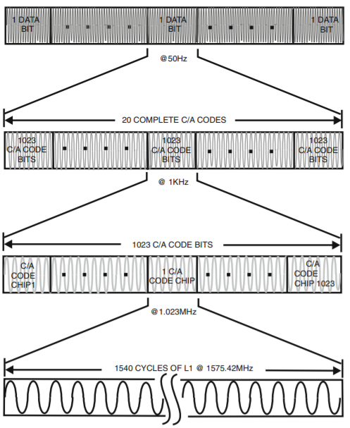
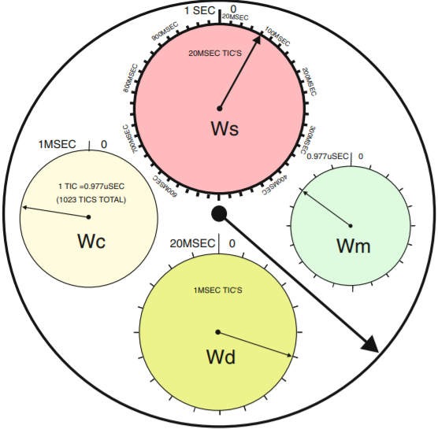

# Tracking Loop Secondary Synchronization and Transmit Time Keeping

## Secondary Synchronization
The secondary synchronization module (`src/main/scala/gps/SecondarySync.scala`) is used for determining the phase of the 50 Hz navigation message bits modulated on top of the PRN codes of the GPS signal.  Once the tracking loop achieves a lock on the GPS signal, the secondary synchronization module begins to operate. Each GPS data bit is 20 ms long, but the tracking loop initially integrates for only 1 ms.  Thus, it does not know where the bit transitions are in the signal stream. If it were to increase its integration time, it may integrate across bit boundaries which could lower the integration result with a worst of case of integrating to 0. The `SecondarySync` module detects the polarity of each 1 ms integration and signals when it is detects a polarity flip, since a polarity flip indicates a bit transition.  Once the phase of the 50 Hz navigation signal is known, the `Packetizer` module can then start to record bits and detect the message subframes, and the tracking loop may be able to increase its integration time to improve performance.  

credit: Doberstein, Dan. Fundamentals of GPS Receivers A HardwareApproach, Springer, 2012
This diagram demonstrates the relationships of the different levels of the GPS signal modulation.  The top shows the 50 Hz (20ms period) data signal that is comprised by 20 total periods of the 1ms, 1023 chip long C/A code.  Each millisecond is one full period of the 1023 length CA code which has been modulated on top of the carrier frequency.  Each part of the tracking loop tracks a different level of this diagram: the carrier loop tracks the carrier, the code loop tracks the C/A code, and the `SecondarySync` module synchronizes to the 50 Hz data.

### Parameters
* `intThreshold`: (Int) the integration threshold determines the threshold that the secondary sync module uses to determine the polarity of the integrations from the tracking loop.  It the integration is greater than `intThreshold.S` then the integration has positive polarity, and if it is less than `-1*intThreshold.S` then the integration has negative polarity.
* `intDumpWidth`: (Int) the width of the integration and dump filter so that the input width of `SecondarySync` actually matches the correct input value width.

### Inputs
* `ipIntDump`: (SInt) signed input value of integration from `IntDump` module.  This is the value that is actually checked when determining the polarity of the current integration.
* `lockAchieved`: (Bool) signal from the tracking loop that indicates that a lock has been achieved so that the `SecondarySync` module may begin operation.
* `dump`: (Bool) the same signal that is delivered to the `IntDump` modules to reset their accumulators.  This signal is used to sample the `ipIntDump` input at the end of the current integration period.

### Outputs
* `secondarySyncAchieved`: (Bool) output signal that indicates when the secondary sync was achieved that is used by the tracking control to determine when to sample the 50 Hz data bits for the `Packetizer` module

### Tests
* testbench with dummy data; run `sbt test:testOnly gps.SecondarySyncSpec` and check that it passes; the test tests that the module can properly detect the data bit transitions with the 1 ms integration input

## Time Keeping
The time keeping module (`src/main/scala/gps/TimeKeeper.scala`) is used to track the transmit time of the GPS signal for the nagivation process.  The tracking loop essentially creates a model of the gps signal at the time it was transmitted from the satellite vehicle, so it is natural that the navigation process can extract this time for navigation purposes from the tracking loop.  Embedded in the navigation message is a Time of Week that is the exact GPS second that the next message subframe starts at. This is at the start of every 300 bit subframe and the precise GPS second in that field corresponds to the start of the first bit of the next subframe.  This sets the lowest time resolution time point for the time tracking process.  The `TimeKeeper` module, from this known point in time, then tracks the number of milliseconds (number of 1023 chip periods), the number of chips mod 1023 (0.977us each, measured from NCO zero crossing like in the CA code generator module), and has a replica of the NCO accumulator to get the smallest level of time resolution (these can all be thought of as a set of dials, as pictured below, that can be measured at any cycle). These times are added to the measured GPS second for each satellite to measure the transmit time for each signal, and these measurements are then sent to the navigation process to be used in the positioning calculation.

credit: Doberstein, Dan. Fundamentals of GPS Receivers A HardwareApproach, Springer, 2012
This diagram demonstrates that this timekeeping process can be thought of as a set of dials that are intially set by the decoded GPS message and then tracked from measurements from the tracking loop.

### Parameters
* `fcoWidth`: (Int) the width of the output of the NCO used to determine the number of PRN code chips
* `resolutionWidth`: (Int) width of the NCO accumulator register so that the `TimeKeeper` module can have an accurate sub-chip level of time resolution.

### Inputs
* `record`: (Bool) control signal to tell the `TimeKeeper` to start recording time.  This is triggered when the GPS second is known exactly from the navigation message.  This timing is well defined because the exact number of bits from when the GPS second is located in the message the point in the message that it corresponds to it known exaclty.
* `preambleDetected`: (Bool) signal that the subframe preamble is detected.  This point in time is used to reference when the start of the next subframe is, which corresponds to the exact GPS second contained in the Time of Week field of the message subframe that is currently being processed.
* `ncoInput`: (UInt) the output of the code tracking loop that is used in the NCO accumulator. This value is integrated and an overflow signals a new chip transition. It is used in `TimeKeeper` for accumulation to get the smallest time resolution level.
* `caInput`: (SInt) the output of the NCO.  A zero crossing indicates a new chip. This is used for tracking the chip count which is mod 1023 from the PRN code length.

### Outputs
* ncoDialOut: (UInt) the accumulated sub-chip level timer
* chipDialOut: (UInt) the accumulated number of chips mod 1023
* msDialOut: (UInt) the accumulated number of milliseconds (number of 1023 length chip periods)  
